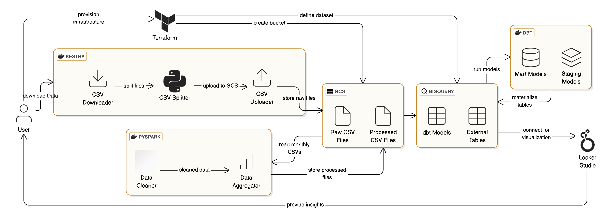
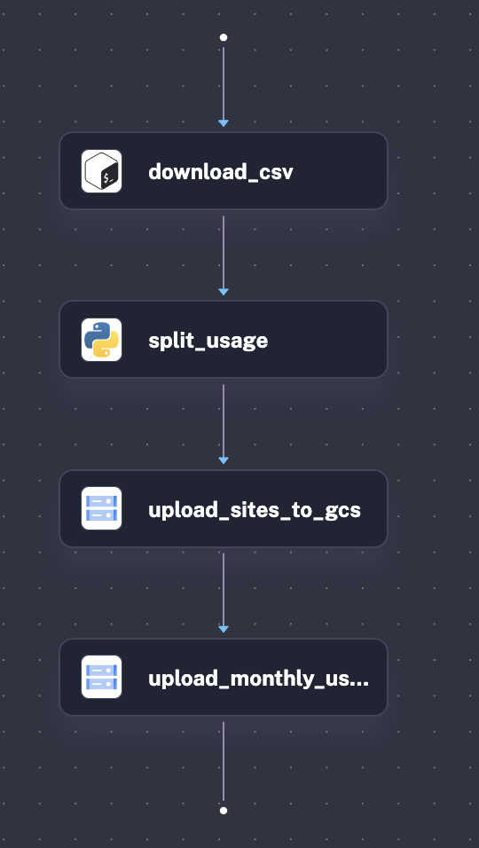
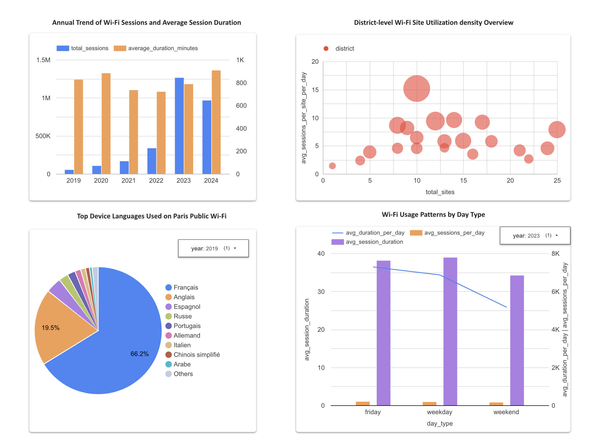

# Paris Public Wi-Fi Usage Analysis
An automated data pipeline analyzing public Wi-Fi usage in Paris, using Kestra for orchestration, Spark for transformation, GCS for data storage, Terraform for IaC, BigQuery + dbt for modeling, Looker Studio for data visualisation.

## Project Objective
The goal of this project is to build an end-to-end data engineering pipeline that transforms raw open data into actionable insights about public Wi-Fi usage in Paris. This pipeline is designed to be automated, scalable, and cloud-native. Specifically, it aims to:

- Ingest and preprocess raw Wi-Fi usage and site availability data from [data.gouv.fr](https://www.data.gouv.fr).
- Organize large-scale usage data into monthly partitions for efficient storage and processing.
- Upload both raw and split data to Google Cloud Storage (GCS) for centralized access.
- Perform distributed preprocessing and daily aggregations using PySpark.
- Load processed datasets into BigQuery and build production-ready models using dbt.
- Visualize key Paris Wi-Fi usage trends, utilization metrics, and user language patterns with Looker Studio.



## Dataset
The pipeline uses two open datasets provided via [data.gouv.fr](https://www.data.gouv.fr):
1. [Paris Wi-Fi - Utilisation des hotspots du réseau](https://www.data.gouv.fr/fr/datasets/paris-wi-fi-utilisation-des-hotspots-du-reseau/)
This dataset provides daily logs of user sessions across all public Wi-Fi hotspots in Paris, including various information such as connection start/end times, session duration, system language, device type, address, number of parquet used.
2. [Paris Wi-Fi - Sites disposant du service](https://www.data.gouv.fr/fr/datasets/paris-wi-fi-sites-disposant-du-service/)
This dataset lists all active Wi-Fi sites locations in Paris, including their administrative district, address, site status.


## Technologies & Tools

| Purpose                        | Tool/Service                            |
|-------------------------------|-----------------------------------------|
| Infrastructure as Code        | Terraform                               |
| Workflow Orchestration        | Kestra (Dockerized)                     |
| File Splitting & Transformation | Python (pandas, unidecode, Dockerized) |
| Data Processing               | PySpark (Dockerized)                    |
| Cloud Storage                 | Google Cloud Storage (GCS)              |
| Data Warehouse                | BigQuery (External Tables + dbt Models) |
| Data Modeling                 | dbt (Dockerized)                        |
| Visualization                 | Looker Studio (Powered by dbt Models)   |

## Folder Structure

```
paris-wifi-analysis-pipeline/
├── dbt/
│   └── paris_wifi_dbt/                # dbt project for BigQuery modeling
├── docker/                            # Dockerfiles for script containers
│   ├── Dockerfile.python
│   ├── Dockerfile.spark  
│   └── Dockerfile.dbt
├── ingestion/                         # Scripts for ingestion & splitting
│   ├── download_data.sh
│   ├── datasplit.py
│   └── upload_to_gcs.py
├── kestra/
│   └── flows/
│       ├── data-ingestion.yml         # Kestra workflow
│       └── set_kv.yml                 # Key-value configuration
├── spark/
│   └── wifi_usage_processing_spark.py # Spark job for preprocessing and daily aggregation
├── terraform/                         # IaC to provision GCS & BigQuery
│   ├── main.tf
│   ├── variables.tf
│   └── terraform.tfstate
├── warehouse/
│   └── gcs_to_bigquery.py             # Script to create BigQuery external tables
├── data_pipeline_architecture.png     # Architecture diagram
├── docker-compose.yml                 # Docker run for Kestra
└── README.md
```
## Data Pipeline Breakdown

### 1. [Infrastructure Provisioning with Terraform](./terraform)

The pipeline begins with **infrastructure setup using Terraform**, which:
- **Creates a GCS bucket** to store raw and processed CSV files.
- **Defines a BigQuery dataset** to house external tables and dbt models.

---

### 2. [Data Ingestion & Orchestration with Kestra](./ingestion/)
A Dockerized [**Kestra workflow**](./kestra/flows/) orchestrates the ingestion phase:
- **Downloads CSV files** `paris_wifi_usage.csv`, `paris_wifi_sites_available.csv`.
- **Splits the usage data into monthly files** using a Python script with pandas. This improves **modularity** and **parallelism**, allowing downstream Spark jobs to process monthly data independently and efficiently.
- **Uploads** both the site file and the monthly usage CSV files to GCS.



### 3. [Data Proprecessing using PySpark](./spark/)
- A Dockerized **PySpark** job reads the monthly CSVs from GCS
- Cleans and enriches the data
- Aggregates usage statistics at a **daily level**
- Writes the cleaned and aggregated results back to GCS

### 4. [Loading External Tables into BigQuery](./warehouse/)
A Python script (using the `google.cloud.bigquery` client) creates **external tables** in BigQuery by referencing the processed data in GCS:
- `wifi_usage_cleaned`
- `agg_wifi_usage_daily`
- `wifi_sites_available`

### 5. [Data Modeling with dbt](./dbt/)
A Dockerized **dbt** project runs on top of the external tables:
- **Staging models** choose, rename, clean and standardize schemas
- **Mart models** aggregate usage based on the analytical needs
- All **dbt models are materialized as native BigQuery tables**

### 6. Interactive Visualization with Looker Studio
**Looker Studio** connects to the **dbt-generated BigQuery tables** to build dynamic dashboards and uncover interesting insights:
- 📈 Monitor public Wi-Fi usage trends over time
- 📅 Compare weekday (Monday–Thursday) vs. Friday & weekend usage patterns
- 🗺️ Explore Wi-Fi hotspot utilization rates across Paris districts
- 🌍 Discover the most frequently used device languages on the Paris public Wi-Fi network

You can explore the published dashboard here ([dashboard](https://lookerstudio.google.com/u/1/reporting/18ff59fb-fb0e-453c-9451-70fa7775b31d/page/aIsGF))


## Sample Insights

- **Paris 1st district (75001)** shows the **highest utilization density** — in terms of both average session count and duration per site per day — despite having comparatively **fewer public hotspots**.
- **2023 saw a significant rebound** in Wi-Fi usage following the Covid-19 pandemic. In contrast, **average session durations were lower in 2021 and 2022**, when restrictions were still widely in place.
- **French, English, and Spanish** are the **most common device languages** detected on the Paris public Wi-Fi network. Notably, the **proportion of French-language users increased during the pandemic**, indicating stronger domestic usage during that period.
-  Interestingly, public Wi-Fi usage **peaks on Fridays**, while both average session count and duration significantly **drop during weekends, compared to weekdays (Monday to Thursday)**.


## Setup & Reproduction Instructions
### Prerequisites
Ensure you have the following installed locally or on VM:
- **Docker** + **Docker Compose**
- **Terraform** (>= v1.3)
- **gcloud CLI** (authenticated to your GCP project)
- **google-cloud-bigquery**
- A Google Cloud project with:
  - BigQuery API enabled
  - GCS (Cloud Storage) enabled
  - A service account with BigQuery and Storage Admin roles


### 1. Clone the Repository
```bash
git clone https://github.com/xinchengppy/paris-wifi-analysis-pipeline.git
cd paris-wifi-analysis-pipeline
```
and add GCP service account keys json file `service-account.json` (keep the exact same name) to the project root directory.

### 2. Provision GCP Infrastructure with Terraform
modify [variables.tf](./terraform/variables.tf) using your GCP account information and run
```bash
cd terraform
terraform init
terraform apply
```

### 3. Launch Kestra Workflow Orchestrator 
Go back to the project root and run:
```bash
docker-compose up -d
```
Then open http://localhost:8080 to access Kestra UI.

### 4. Run the ETL Pipeline via Kestra
Inside the Kestra UI:	
1.	Upload flows:
    - kestra/flows/data-ingestion.yml
    - kestra/flows/set_kv.yml
2.	Run the data-ingestion flow.

### 5. Run PySpark Processing inside Docker
To enable Spark to interact with GCS, we use the official Google Cloud Storage Connector for Hadoop (`gcs-connector-hadoop3-latest.jar`), which is downloaded and added to the Docker image during build. Download it first into the expected location:
```bash
wget https://storage.googleapis.com/hadoop-lib/gcs/gcs-connector-hadoop3-latest.jar -P docker/jars/
```
Then, from the root project directory, build and run the Spark Docker container:
```bash
docker build -t spark-runner -f docker/Dockerfile.spark .
docker run -it --rm \
  -v ~/.config/gcloud:/root/.config/gcloud:ro \
  -v "$(pwd)/spark:/app" \
  spark-runner
```
This executes `wifi_usage_processing_spark.py` to:
- Load monthly CSVs from GCS
- Clean and aggregate into daily usage data
- Upload the result to GCS

### 6. Create External Tables in BigQuery
modify [gcs_to_bigquery.py](./warehouse/gcs_to_bigquery.py) **line 4-6** using your GCP account information
Then run:
```bash
python warehouse/gcs_to_bigquery.py
```
This creates 3 external tables in BigQuery.

### 7. Build Analytics Models with dbt
From the root project directory, run
```bash
docker build -t paris-wifi-dbt -f docker/Dockerfile.dbt .
```
```bash
docker run -it \
  -v "$(pwd)/dbt/paris_wifi_dbt:/app" \
  -v "$(pwd)/.dbt:/root/.dbt" \
  -v "$(pwd)/service-account.json:/key.json" \
  -e GOOGLE_APPLICATION_CREDENTIALS=/key.json \
  paris-wifi-dbt run --profiles-dir /root/.dbt
```
This command:
- Mounts your dbt project folder to `/app`
- Mounts your local profiles.yml (for BigQuery config) from `.dbt/`
- Provides the service account key and sets `GOOGLE_APPLICATION_CREDENTIALS`
- Runs dbt run using your configured BigQuery dataset

✅ Make sure your .dbt/profiles.yml is correctly configured for BigQuery and references the same service account and project as the rest of the pipeline.


### 8. Visualize in Looker Studio
- Connect Looker Studio to your BigQuery dataset
- Use the final dbt models to build dashboards

## Future Improvement Opportunities
1. 	Automate Spark and dbt execution through scheduled Kestra workflows
2.  Implement daily or weekly scheduling for real-time data analysis
3.  Integrate unit tests to validate assumptions, null values, and schema consistency throughout the models


## Acknowledgments
This project was developed as part of the [DataTalksClub Data Engineering Zoomcamp (2025)](https://github.com/DataTalksClub/data-engineering-zoomcamp).
Huge thanks to the community and mentors for providing such an exceptional learning experience!


